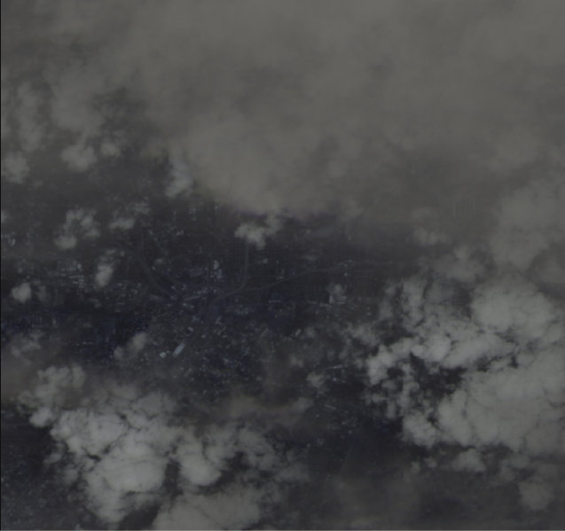

# Satellite Intelligence Explorer

A modern, production-ready Next.js application for exploring, analyzing, and downloading high-resolution satellite imagery from NASA, Copernicus, and NASA GIBS. Designed for researchers, educators, emergency responders, and enthusiasts, this app provides a seamless, interactive map interface with robust logging, advanced filtering, and a modern, responsive UI.



## Key Features

- **Multi-Provider Support:**
  - **NASA Earth API:** Fetches true-color imagery for any location and date, with user-selectable field of view (`dim`) and resolution.
  - **Copernicus Sentinel-2:** Advanced search for available scenes, cloud cover filtering, and high-res image download. Requires Copernicus API credentials.
  - **NASA GIBS:** Browse and download daily global imagery from multiple satellites/layers. Supports high-res stitched images via tile compositing.
- **Interactive Map Explorer:**
  - Built with `react-leaflet` for smooth pan/zoom and location picking.
  - Floating action button for quick actions.
  - Info panel with real-time feedback, available dates, and scene selection.
- **Modern UI/UX:**
  - Fully responsive, dark/light mode, Google-inspired minimal design.
  - Fira Code and Geist fonts for a clean, technical look.
  - Collapsible controls, clear expand/collapse hints, and accessible navigation.
- **Granular Logging:**
  - All user actions (map clicks, input changes, button presses, etc.) are logged client-side and sent to `/api/client-log`.
  - All backend API requests, responses, and errors are logged to `logs/api-requests.log` for deep debugging and auditing.
- **Robust Error Handling:**
  - If a requested date is unavailable, the UI lists available dates/scenes (±7 days) as clickable chips.
  - Always displays the actual image date from the API, not just the requested date.
- **Security & Production Readiness:**
  - API keys and credentials are never exposed to the client.
  - All sensitive operations are handled server-side.
  - MIT licensed for open use and contribution.

## Supported Satellite Services

### 1. NASA Earth API
- Fetches true-color imagery for any coordinates and date.
- User-selectable `dim` (field of view in degrees) and resolution.
- Returns the actual image date from NASA, not just the requested date.
- Lists available dates if the requested date is unavailable.

### 2. Copernicus Sentinel-2
- Scene availability check (±7 days) with cloud cover filtering.
- User selects from available scenes; only valid acquisition times are used for image fetch.
- Supports `dim` and resolution parameters.
- Requires Copernicus API credentials (see setup below).

### 3. NASA GIBS (Global Imagery Browse Services)
- Browse daily global imagery from multiple satellites/layers (e.g., MODIS, VIIRS).
- Preview tiles and fetch high-res stitched images (using `sharp`).
- Actual image date is determined from GIBS capabilities XML.
- `dim` is not used for GIBS (by design).

## Getting Started

### 1. Clone the repository
```bash
git clone <repository-url>
cd <repository-folder-name>
```

### 2. Install dependencies
```bash
npm install
# or
yarn install
# or
pnpm install
# or
bun install
```

### 3. Set up environment variables
Create a `.env` file in the root directory with the following:

```
NASA_API_KEY=your_nasa_api_key_here
COPERNICUS_CLIENT_ID=your_copernicus_client_id_here
COPERNICUS_CLIENT_SECRET=your_copernicus_client_secret_here
```
- **NASA API Key:** [Get one here](https://api.nasa.gov/)
- **Copernicus Credentials:** [Register here](https://dataspace.copernicus.eu/)

### 4. Run the development server
```bash
npm run dev
# or
yarn dev
# or
pnpm dev
# or
bun dev
```
The app will be available at [http://localhost:3000](http://localhost:3000) (or another port if 3000 is in use).

### 5. Build and run for production
```bash
npm run build
npm start
```

## Directory Structure
- `src/app/InteractiveMapExplorer.tsx` — Main map UI and logic
- `src/app/api/` — All backend API routes (NASA, Copernicus, GIBS, logging)
- `logs/api-requests.log` — All API and client logs
- `public/` — Static assets, including custom favicon
- `screenshots/` — Example images for documentation

## Logging & Debugging
- All user actions and API requests are logged for transparency and debugging.
- Logs are written to `logs/api-requests.log` (ensure this directory is writable).
- For deep debugging, inspect this log file or add additional logging as needed.

## Troubleshooting
- **Missing Images:**
  - Check available dates/scenes in the UI; try selecting a different date.
  - Ensure your API keys/credentials are correct and not rate-limited.
- **Copernicus Errors:**
  - Make sure both `COPERNICUS_CLIENT_ID` and `COPERNICUS_CLIENT_SECRET` are set in `.env`.
- **GIBS High-Res Errors:**
  - Ensure the server has enough memory for image stitching (uses `sharp`).
- **Port Issues:**
  - If port 3000 is in use, Next.js will prompt for another port.

## Deployment
- Deploy on [Vercel](https://vercel.com/) or any Node.js server.
- Ensure all environment variables are set in your deployment environment.
- For production, use `npm run build` and `npm start`.

## Docker

You can run this app in a Docker container for easy deployment anywhere.

### 1. Build the Docker image
```bash
docker build -t satellite-intelligence-explorer .
```

### 2. Run the container
```bash
docker run -p 3000:3000 \
  -e NASA_API_KEY=your_nasa_api_key_here \
  -e COPERNICUS_CLIENT_ID=your_copernicus_client_id_here \
  -e COPERNICUS_CLIENT_SECRET=your_copernicus_client_secret_here \
  satellite-intelligence-explorer
```

### 3. Example Dockerfile
```Dockerfile
# Use official Node.js image
FROM node:20-alpine
WORKDIR /app
COPY . .
RUN npm install && npm run build
EXPOSE 3000
CMD ["npm", "start"]
```

- Make sure to set all required environment variables (`NASA_API_KEY`, `COPERNICUS_CLIENT_ID`, `COPERNICUS_CLIENT_SECRET`) when running the container.
- You can also use a `.env` file with Docker Compose for local development.

## License

MIT License — see [LICENSE](LICENSE) for details. Open for use, modification, and contribution.

---

**Satellite Intelligence Explorer** — Explore, analyze, and unlock insights from real-time NASA & Copernicus satellite imagery. Earth observation, reimagined.
